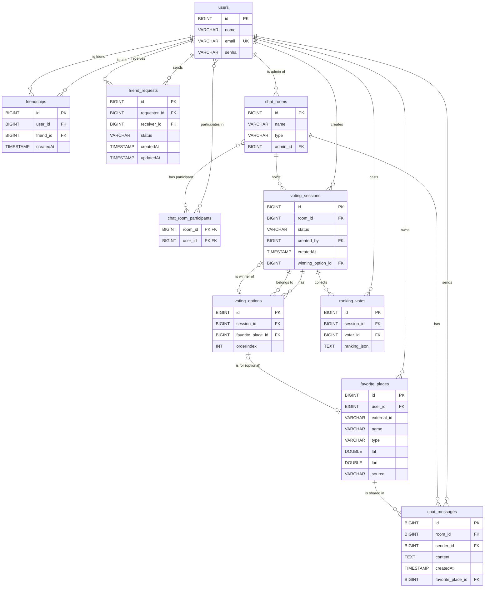

# Javai - Modelo Relacional

Este documento descreve o esquema de banco de dados para a aplicação Javai, baseado nas entidades JPA. Ele inclui descrições de tabelas, detalhes de colunas, relacionamentos e um Diagrama Entidade-Relacionamento (DER) visual.

---

## Descrições das Tabelas

### `users`
Armazena informações da conta do usuário.

| Coluna | Tipo | Restrições | Descrição |
|---|---|---|---|
| `id` | `BIGINT` | **Primary Key** | Identificador único para o usuário. |
| `nome` | `VARCHAR` | `NOT NULL` | O nome completo do usuário. |
| `email` | `VARCHAR` | `NOT NULL`, `UNIQUE` | O endereço de e-mail do usuário, usado para login. |
| `senha` | `VARCHAR` | `NOT NULL` | A senha do usuário (com hash). |

### `friendships`
Representa o relacionamento bidirecional entre dois usuários que são amigos. Duas entradas são criadas para cada amizade (A -> B e B -> A).

| Coluna | Tipo | Restrições | Descrição |
|---|---|---|---|
| `id` | `BIGINT` | **Primary Key** | Identificador único para a entrada de amizade. |
| `user_id` | `BIGINT` | `NOT NULL`, **Foreign Key** para `users.id` | O ID do primeiro usuário no relacionamento. |
| `friend_id` | `BIGINT` | `NOT NULL`, **Foreign Key** para `users.id` | O ID do segundo usuário no relacionamento. |
| `created_at` | `TIMESTAMP` | `NOT NULL` | Timestamp de quando a amizade foi estabelecida. |
| | | `UNIQUE(user_id, friend_id)` | Garante que o par usuário-amigo seja único. |

### `friend_requests`
Rastreia solicitações de amizade pendentes, aceitas e rejeitadas entre usuários.

| Coluna | Tipo | Restrições | Descrição |
|---|---|---|---|
| `id` | `BIGINT` | **Primary Key** | Identificador único para a solicitação de amizade. |
| `requester_id` | `BIGINT` | `NOT NULL`, **Foreign Key** para `users.id` | O usuário que enviou a solicitação. |
| `receiver_id` | `BIGINT` | `NOT NULL`, **Foreign Key** para `users.id` | O usuário que recebeu a solicitação. |
| `status` | `VARCHAR(20)` | `NOT NULL` | O status atual da solicitação (`PENDING`, `ACCEPTED`, `REJECTED`). |
| `created_at` | `TIMESTAMP` | `NOT NULL` | Timestamp de quando a solicitação foi criada. |
| `updated_at` | `TIMESTAMP` | `NOT NULL` | Timestamp da última atualização de status. |

### `favorite_places`
Armazena os locais que um usuário marcou como seus favoritos.

| Coluna | Tipo | Restrições | Descrição |
|---|---|---|---|
| `id` | `BIGINT` | **Primary Key** | Identificador único para a entrada de local favorito. |
| `user_id` | `BIGINT` | `NOT NULL`, **Foreign Key** para `users.id` | O usuário dono deste favorito. |
| `external_id` | `VARCHAR` | `NOT NULL` | O ID do local na fonte externa (ex: OpenStreetMap). |
| `name` | `VARCHAR` | `NOT NULL` | O nome do local. |
| `type` | `VARCHAR` | `NOT NULL` | A categoria/tipo do local (ex: 'restaurant'). |
| `lat` | `DOUBLE` | `NOT NULL` | A latitude do local. |
| `lon` | `DOUBLE` | `NOT NULL` | A longitude do local. |
| `source` | `VARCHAR` | | A fonte original dos dados (ex: 'OSM'). |
| | | `UNIQUE(user_id, name, lat, lon)`| Impede que um usuário favorite o mesmo local exato múltiplas vezes. |

### `chat_rooms`
Representa uma sala de chat, que pode ser uma mensagem direta entre dois usuários ou um chat em grupo.

| Coluna | Tipo | Restrições | Descrição |
|---|---|---|---|
| `id` | `BIGINT` | **Primary Key** | Identificador único para a sala de chat. |
| `name` | `VARCHAR` | `NOT NULL` | O nome da sala de chat (ex: "Usuário A & Usuário B" ou "Nome do Grupo"). |
| `type` | `VARCHAR(16)` | `NOT NULL` | O tipo de sala (`DIRECT` ou `GROUP`). |
| `admin_id` | `BIGINT` | **Foreign Key** para `users.id` | Para chats em `GROUP`, o usuário que é o administrador da sala. |

### `chat_room_participants` (Tabela de Junção)
Vincula usuários às salas de chat das quais eles participam.

| Coluna | Tipo | Restrições | Descrição |
|---|---|---|---|
| `room_id` | `BIGINT` | **Primary Key**, **Foreign Key** para `chat_rooms.id`| O ID da sala de chat. |
| `user_id` | `BIGINT` | **Primary Key**, **Foreign Key** para `users.id`| O ID do usuário participante da sala. |

### `chat_messages`
Armazena mensagens individuais enviadas dentro de uma sala de chat.

| Coluna | Tipo | Restrições | Descrição |
|---|---|---|---|
| `id` | `BIGINT` | **Primary Key** | Identificador único para a mensagem. |
| `room_id` | `BIGINT` | `NOT NULL`, **Foreign Key** para `chat_rooms.id` | A sala onde a mensagem foi enviada. |
| `sender_id` | `BIGINT` | `NOT NULL`, **Foreign Key** para `users.id` | O usuário que enviou a mensagem. |
| `content` | `TEXT` | `NOT NULL` | O conteúdo de texto da mensagem. |
| `created_at` | `TIMESTAMP` | `NOT NULL` | Timestamp de quando a mensagem foi enviada. |
| `favorite_place_id`| `BIGINT` | **Foreign Key** para `favorite_places.id` | Uma referência opcional se a mensagem estiver compartilhando um local favorito. |

### `voting_sessions`
Representa uma sessão de votação por ordem de preferência dentro de um chat em grupo.

| Coluna | Tipo | Restrições | Descrição |
|---|---|---|---|
| `id` | `BIGINT` | **Primary Key** | Identificador único para a sessão de votação. |
| `room_id` | `BIGINT` | `NOT NULL`, **Foreign Key** para `chat_rooms.id` | A sala de chat de grupo onde a votação está ocorrendo. |
| `status` | `VARCHAR(16)` | `NOT NULL` | O status da sessão (`OPEN` ou `CLOSED`). |
| `created_by` | `BIGINT` | `NOT NULL`, **Foreign Key** para `users.id` | O usuário (admin) que iniciou a sessão. |
| `created_at` | `TIMESTAMP` | `NOT NULL` | Timestamp de quando a sessão foi criada. |
| `winning_option_id`| `BIGINT` | **Foreign Key** para `voting_options.id` | A opção que venceu a votação após o fechamento da sessão. |

### `voting_options`
Representa uma das escolhas (um local favorito) em uma sessão de votação.

| Coluna | Tipo | Restrições | Descrição |
|---|---|---|---|
| `id` | `BIGINT` | **Primary Key** | Identificador único para a opção de votação. |
| `session_id` | `BIGINT` | `NOT NULL`, **Foreign Key** para `voting_sessions.id` | A sessão à qual esta opção pertence. |
| `favorite_place_id`| `BIGINT` | `NULLABLE`, **Foreign Key** para `favorite_places.id`| O local favorito sendo votado. Pode ser nulo se o local for deletado. |
| `order_index` | `INT` | `NOT NULL` | A ordem de exibição original da opção. |

### `ranking_votes`
Armazena o voto ranqueado de um usuário para uma sessão de votação específica.

| Coluna | Tipo | Restrições | Descrição |
|---|---|---|---|
| `id` | `BIGINT` | **Primary Key** | Identificador único para o voto. |
| `session_id` | `BIGINT` | `NOT NULL`, **Foreign Key** para `voting_sessions.id` | A sessão para a qual este voto é destinado. |
| `voter_id` | `BIGINT` | `NOT NULL`, **Foreign Key** para `users.id` | O usuário que realizou o voto. |
| `ranking_json` | `TEXT` | `NOT NULL` | Uma string JSON representando a lista ordenada de `voting_options.id`s. |
| | | `UNIQUE(session_id, voter_id)` | Garante que um usuário possa votar apenas uma vez por sessão. |

---

## Entity-Relationship Diagram (ERD)

